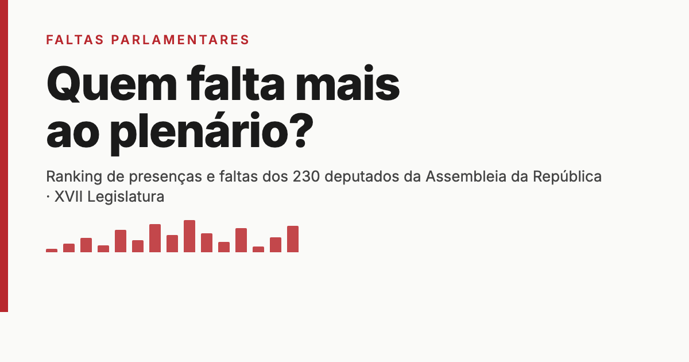

# faltas-parlamentares

Site público, em português europeu, que acompanha as ausências dos deputados da Assembleia da República na XVII Legislatura (em curso).

🔗 **[faltasparlamentares.sergioferreira.net](https://faltasparlamentares.sergioferreira.net)**



Os dados vêm das páginas oficiais de [presenças em reuniões plenárias](https://www.parlamento.pt/DeputadoGP/Paginas/reunioesplenarias.aspx) publicadas pelo Parlamento (uma por deputado), complementadas pelo [portal de dados abertos](https://www.parlamento.pt/Cidadania/paginas/dadosabertos.aspx) para metadados. Não há comentário editorial nem interpretação política — só os números, organizados de forma legível.

## Estrutura

- `ingest/` — pipeline em Python (3.12, [uv](https://github.com/astral-sh/uv), httpx) que faz scraping das páginas "Presenças às Reuniões Plenárias" e escreve JSON para `site/src/data/`.
- `site/` — site estático em [Astro](https://astro.build), gerado a partir dos JSON do `ingest/`.
- `.github/workflows/update.yml` — cron diário (06:00 UTC) que corre o `ingest`, faz commit dos dados se mudaram, e republica no GitHub Pages independentemente disso.

## Desenvolvimento

```bash
# Ingest (Python)
cd ingest
uv sync
uv run python -m ingest.main                  # usa cache local em ingest/.cache/http
FALTAS_NO_CACHE=1 uv run python -m ingest.main  # força re-fetch (como o CI)

# Site (Astro) — pnpm, não npm
cd site
pnpm install
pnpm dev        # http://localhost:4321
pnpm build      # gera dist/
pnpm preview    # serve dist/
```

Os JSON gerados pelo `ingest` são commitados para o repositório — o site não corre o ingest no build.

## Classificação das ausências

Cada reunião plenária é classificada pelo Parlamento numa de sete categorias, todas usadas no site:

| Código | Significado |
|--------|-------------|
| **P** | Presença |
| **FJ** | Falta Justificada |
| **FI** | Falta Injustificada |
| **AMP** | Ausência em Missão Parlamentar |
| **FQV** | Falta ao Quórum de Votação |
| **PNO** | Presença Noutro Órgão |
| **F** | Falta (não classificada — provisória, geralmente reclassificada como FJ nas semanas seguintes) |

Ver [`/metodologia`](https://faltasparlamentares.sergioferreira.net/metodologia) no site para detalhes, incluindo o tratamento de substituições temporárias entre efetivos e suplentes.

## Limitações

- Apenas reuniões plenárias. Presenças em comissões parlamentares não estão refletidas.
- Registos de efetivos e respetivos suplentes são contados separadamente.
- Os dados são tão fiáveis quanto a publicação oficial. Correções posteriores pelo Parlamento aparecem aqui no ciclo de ingestão seguinte.

## Licença

[MIT](LICENSE). Os dados são públicos e da responsabilidade do Parlamento.
